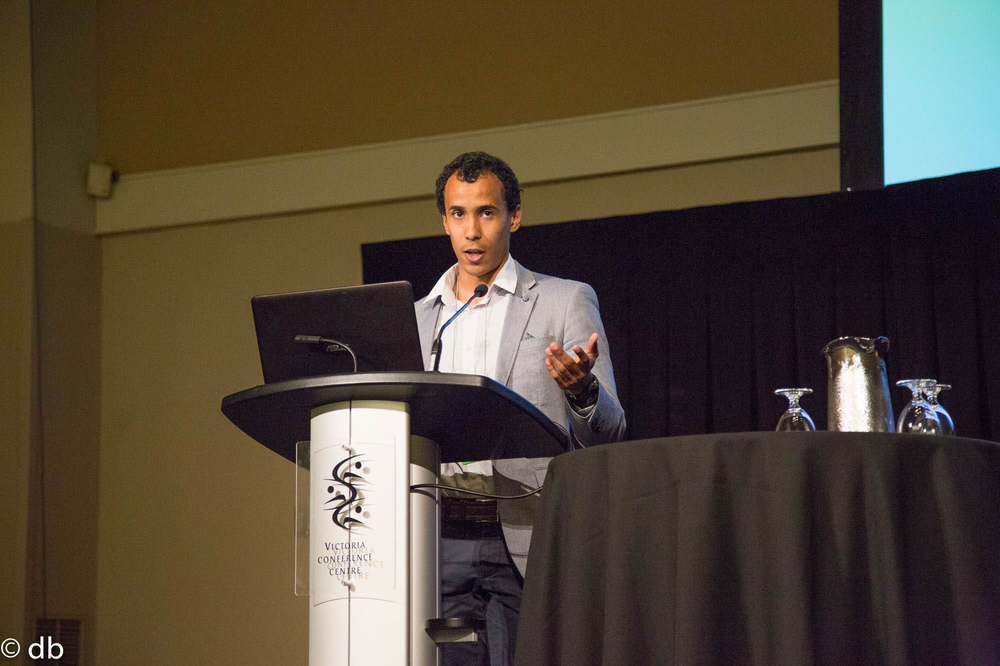
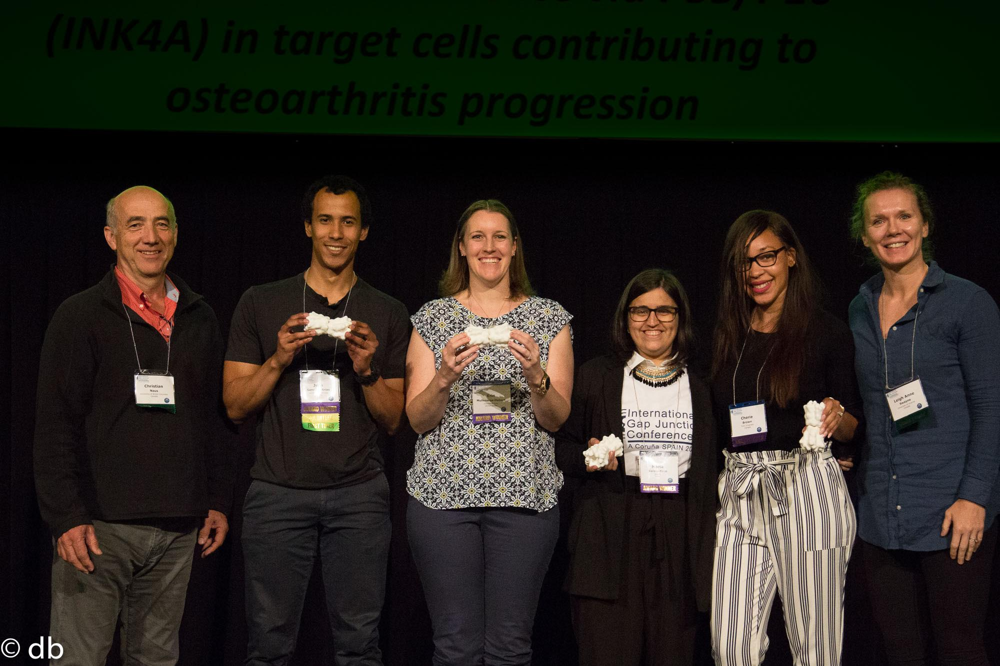

```{r setup, include=FALSE}
knitr::opts_chunk$set(echo = TRUE)
```

## About me
Hi there folks! My *(full)* name is Juan Camilo Sanchez Arias. Seems long, eh? That's because of my Afro-Latinx background and how names work for us Hispanics (you can learn more about it [here](https://en.wikipedia.org/wiki/Surname#Spanish_compound_surnames)). I was born in  Cali (Colombia), the most ***calidosa*** city and capital of salsa. I'm a [Normal High School](https://en.wikipedia.org/wiki/Normal_school) Graduate, Doctor of Medicine from [Universdiad del Valle School of Medicine](http://salud.univalle.edu.co/pregrados/medicina-y-cirugia) (2007-2014), and I recently [defended my PhD in Neuroscience](http://www.uvic.ca/medsci/home/news/current/2020-04-15-sanchez-arias-phd-defense.php) at the University of Victoria (2015-2020).

I'm all about biomedical research (specially that dealing with neuronal networks and molecular mechanisms of synaptic transmission), translational research, science communication, and evidence-based medicine.


 | 
--- |--- |
Me giivng one of the 4 NB Gulila Star Award talk at IGJC2019 | The other part of the award was a 3D printed connexin!

I've started to merge my techy hobbies with my science and medicine curiosity. This led me to a path to learn `R` and this space (originally discussed during a lab meeting). Here, during `R Jam` Sessions I will practice and share my use of `R` for data science and visualization, from topics close to my research interests, others dear to my heart (hi homesickness? *how you doing?*), and some I've come across purely by chance.

As a beginner, my code is not the prettiest nor the most efficient and I'm always recpetive to construcutive feedback. So don't hesitate in reaching out through issues or Twitter [\@juan_sanar](https://www.twitter.com/juan_sanar/) to drop tips, advice, or words of encourgament.

## R Jam Sessions Schedule
Date | R Jam Topic | Relevant Links
---| ---| ---|
2020-05-26 | [Vol.1: Exploring some genes in the developmental brain transcriptome map - brain-span](https://juansamdphd.github.io/rjam/) | [**Brain**span](http://www.brainspan.org/rnaseq/search/index.html)
2020-06-12 | Vol.2: Explore Cali, ve! | [Datos Abiertos](http://datos.cali.gov.co/) - [Cali](https://en.wikipedia.org/wiki/Cali)

