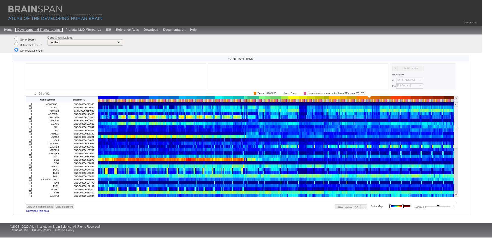

```{r setup, include=FALSE}
knitr::opts_chunk$set(echo = TRUE)
```

## What is this? A website? A report? RStudio? {.tabset}

### R Markdown 

This is an R Markdown document. Markdown is a simple formatting syntax for authoring HTML, PDF, and MS Word documents. For more details on using R Markdown see <http://rmarkdown.rstudio.com>.

When we **Knit** an R Markdown (.rmd) it will generate a document that includes both content as well as the output of any embedded R code chunks within the document.

> Slack has a flavour of Markdown. You can also find Markdown on GitHub (GitHub flavour) and Reddit!

This an example: You can embed an R code chunk like this:

```{r cars}
summary(cars)
```

### Including Plots

You can also embed plots, for example:

```{r pressure, echo=FALSE}
plot(pressure)
```

In the example above, the `echo = FALSE` parameter was added to the ` ```{r}``` ` code chunk to prevent printing of the R code `plot(pressure)` that generated the plot.

Let's put that aside and start exploring some data!

## **Brain**span - Atlas of the Developing Human Brain

[**Brain**span](http://www.brainspan.org/static/home) contains a developmental transcriptome database.

```{r brainspan_screenshot, echo = FALSE}

```
From here, we can easily download normalized transcript levels throughout development in different brain regions.

Let's check *PANX1* throughout development. Click [here](https://github.com/juansamdphd/rjam/tree/master/PANX1) to download the files.

## *PANX1* developmental profile

### Data exploration

Let's import the files for *PANX1* and create a data.frame

```{r PANX1, message=FALSE, warning=FALSE}
library(readr)
library(tidyverse)
PANX1_RNA <- t( # transposes the .csv
  read_csv("PANX1/Expression.csv", # reads the .csv file
           col_names = FALSE, # first row as values 
           col_types = cols(X1 = col_skip()))  # removes the first row
)

PANX1_COL <- read_csv("PANX1/Columns.csv") # Imports Columns.csv

PANX1 <- data.frame(
  cbind(PANX1_COL, 
        PANX1_log2_RPKM = PANX1_RNA)) # merges PANX1_COL & PANX1_RNA 

rownames(PANX1) <- 1:nrow(PANX1) # gets row numbers
```
Let's now check the first values and structure of `PANX1`
```{r}
head(PANX1) # prints first 6 observations in PANX1
str(PANX1) # prints `PANX1` structure
```

Let's keep exploring the dataset and find out how many `unique` `donor_id` values are in `PANX1`. In other words let's check the biological replicates.

```{r checking_bio_replicates}
length(unique(PANX1$donor_id))
```

Let's group `PANX1` using `group_by` and `donor_id`. 

*How many observations does each donor have?*

```{r grouping_PANX1_by_donor_id}
PANX1 %>% group_by(donor_id) %>% count(sort = TRUE) %>% print(n=42)
```
*How many observations from each strucutre and top level structure?*

> Hint: One plate to rule them all!

```{r grouping_by_structures}
PANX1 %>% group_by(structure_name, top_level_structure_name, top_level_structure_abbreviation) %>% count(sort = TRUE) %>% print(n = 26)

PANX1 %>% group_by(donor_id) %>% filter(top_level_structure_abbreviation == "NP") %>% count(sort = TRUE) %>% print(n=42)
```

### Subsetting *PANX1* dataframe

So from the above analysis, structures derived from the neural plates are the most sampled by donor. Let's subset `PANX1` and create a data frame with microarray data obtained from neural plate-derived structures (`top_level_structure_abbreviation == "NP"`)

```{r subset_PANX1_summary_stats, message=FALSE}
library(Rmisc) # Load Rmisc package
PANX1_NP <- PANX1 %>% # pipe `PANX1` into filter
  filter(top_level_structure_abbreviation == "NP") %>% # filter "NP" structures
  summarySE(measurevar = "PANX1_log2_RPKM", 
            groupvars = c("donor_id", "donor_name", "donor_age"),
            na.rm = TRUE) %>% # get summary stats with Rmisc
  filter(N!=1) # filter out samples with N = 1 (producing NaNs)
```

Great! We have created `PANX1_NP` with *PANX1* transcript levels in neural plate strucutres and their summary statistics. We now have to deal with one more problem: `donor_age`. If you recall `str(PANX1)`, this variable type is `chr`. 

Let's use some of the some of the characters to our advantage and create prenatal (pcw) and postnatal (mos, yrs) dataframes.

```{r PANX1_prenatal, messages = FALSE}
PANX1_NP_pre <- PANX1_NP %>% 
  filter(str_detect(donor_age, "pcw"))

PANX1_NP_pre <- PANX1_NP_pre %>% 
  mutate(donor_age = 
           as.numeric(gsub(" pcw", "", PANX1_NP_pre$donor_age))) %>%
  arrange(donor_age)
```

We got in our hands now a nice "plottable" data frame. So, let's plot!
```{r PANX1_NP_pre_plot, message=FALSE, warning=FALSE}
PANX1_NP_pre %>% ggplot(aes(donor_age, PANX1_log2_RPKM)) + geom_point() + geom_smooth(fill = "blue", alpha = 0.2) + scale_x_continuous("Postconception weeks (pcw)", limits = c(7,38), breaks = seq(from = 8, to = 38, by = 2)) + ylab("mRNA (log2 RPKM)") + ggtitle("Panx1") + theme(plot.title = element_text(hjust = 0.5)) + ylim(0,6.5) + theme_bw()
```
