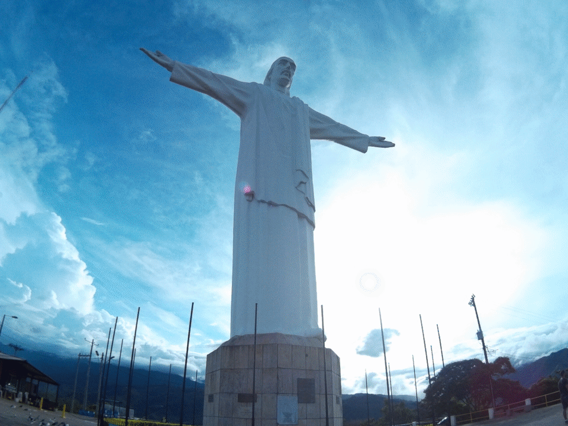

```{r setup, include=FALSE}
knitr::opts_chunk$set(echo = TRUE)
```

## About Vol.2
Inspired by [*Aguante*](https://www.youtube.com/watch?v=XJNZ2Wc5IqQ), the most recent release by [Superlitio](https://en.wikipedia.org/wiki/Superlitio) (one of my all-time favourite Colombian rock bands), I started looking for openly available data about my hometown, Cali (Colombia).



To my pleasant surprise, I found this: [Datos Abiertos](http://datos.cali.gov.co/), a portal with open data that I could use to practice my `R` skills while listening to *Aguante* and other *Cali's classics* `r emo::ji("smile")`. 

### Accidentals deaths {.tabset}
Cali's city council has kept records of accidental deaths by time of day, day of the week, sex, age, and mechanisms. Let's take a dive in.

#### By day of the week

#### By time of day

```{r accid_death_times, warning=FALSE, message=FALSE, echo=FALSE}

library(readr)
library(tidyverse)
library(plotly)

accid_death_times <- read_csv("http://datos.cali.gov.co/dataset/2b9d2d3d-5d62-4035-bd9f-bc2543039e2f/resource/a0f29617-a5a5-4642-9c0d-7886d42514f8/download/muertes_accidentales_seg_n_hora_de_ocurrencia__1994_-_2017.csv")

accid_death_times <- rename(accid_death_times, "Hours" = "Hora")

accid_death_times[,2:25] <- sapply(accid_death_times[,2:25], as.numeric)

accid_death_times <- accid_death_times[-c(9:10),]

accid_death_times <- accid_death_times[,-9]

accid_death_times$Hora <- factor(c(accid_death_times$Hours))

accid_death_times_long <- pivot_longer(accid_death_times, cols = c("1994":"2017"), names_to = "Year", values_to = "freq")

# accid_death_times_long$year <- as.numeric(accid_death_times_long$year)

# accid_death_times_long <- pivot_wider(accid_death_times_long, names_from = Hora, values_from = freq)

p <- ggplot(data = accid_death_times_long, aes(x= Hours, y = freq)) + 
	geom_line(aes(group = Year), size = 0.5, colour = "gray") +
	geom_line(data = accid_death_times_long %>% group_by(Hours) %>% summarise(freq = mean(freq)), 
						aes(x = Hours, y = freq, group = 1, colour = "red"), size =1) +
	# geom_point() +
	# facet_wrap(~year) +
	theme_bw() +
	labs(title = "Accidental deaths by time of day",
			 subtitle = "Cali (Colombia), 1994-2017"
			 , caption = "Source: http://datos.cali.gov.co/") +
	ylab("Absolute frequency") +
	xlab("Time of day") +
	scale_colour_manual(name = "", guide = "legend", values = c("red" = "red"), labels = c("Media")) +
	theme(plot.subtitle = element_text(face = "italic"), 
				axis.text.x = element_text(angle = 45, hjust = 0.9), legend.position = "none")
# p
ggplotly(p) %>%
	layout(title = list(text = paste0('Accidental deaths by time of day',
																		'<br>',
																		'<sup>',
																		'Cali (Colombia), 1994-2017 | Source: http://datos.cali.gov.co/',
																		'</sup>')))
```

#### By age and sex

#### By mechanim

## R Jam Sessions Schedule
Date | R Jam Topic | Relevant Links
---| ---| ---|
2020-05-26 | [Vol.1: Exploring some genes in the developmental brain transcriptome map - brain-span](https://juansamdphd.github.io/rjam/vol_1) | [**Brain**span](http://www.brainspan.org/rnaseq/search/index.html)
2020-06-12 | [Vol.2: Explore Cali, ve!](https://juansamdphd.github.io/rjam/vol_2) | [Datos Abiertos](http://datos.cali.gov.co/) - [Cali](https://en.wikipedia.org/wiki/Cali)

